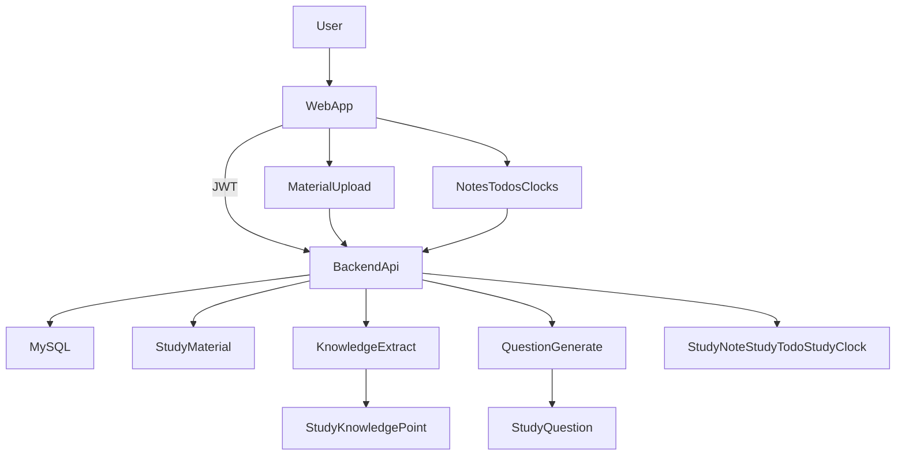

## 现状速览（基于代码）

- **后端已具备**：
  - **账号/JWT**：`/auth/register`、`/auth/login`、`/auth/me`（`[backend/src/main/java/com/studyhelper/controller/AuthController.java](backend/src/main/java/com/studyhelper/controller/AuthController.java)`）
  - **资料上传+解析入库**：`/material/upload`，支持 `txt/pdf/docx`，并把全文存入 `StudyMaterial.contentText`（`[backend/src/main/java/com/studyhelper/service/MaterialService.java](backend/src/main/java/com/studyhelper/service/MaterialService.java)`、`[backend/src/main/java/com/studyhelper/service/FileParseService.java](backend/src/main/java/com/studyhelper/service/FileParseService.java)`）
  - **知识点抽取**：`/knowledge/extract`（`[backend/src/main/java/com/studyhelper/controller/KnowledgePointController.java](backend/src/main/java/com/studyhelper/controller/KnowledgePointController.java)`）
  - **出题**：`/question/generate`（`[backend/src/main/java/com/studyhelper/controller/QuestionController.java](backend/src/main/java/com/studyhelper/controller/QuestionController.java)`）
  - **AI 问答（通用）**：`/qwen/ask`（`[backend/src/main/java/com/studyhelper/controller/QwenController.java](backend/src/main/java/com/studyhelper/controller/QwenController.java)`）
- **已有但未形成产品闭环的表/实体**：`StudyNote`、`StudyTodo`、`StudyClock`（目前缺少对应 Controller/页面）。
- **重要风险**：`application.yml` 里存在明文 `dashscope.api-key`（`[backend/src/main/resources/application.yml](backend/src/main/resources/application.yml)`），后续应改为环境变量/本地配置，不进仓库。

## 目标用户任务流（大学课程）

- **导入**：上传课件/讲义/复习资料
- **结构化**：抽取知识点 → 按章节/主题组织
- **学习**：做题/自测 → 记录错题与掌握度
- **沉淀**：写笔记、把笔记挂到知识点/资料
- **计划**：待办 + 截止日期（作业/考试）+ 每日学习时长
- **反馈**：周报/月报、薄弱点、复习建议

## 功能增量设计（按迭代拆分）

### Iteration A（最快见效，强复用现有表）

- **笔记系统**（围绕 `StudyNote`）
  - 后端：CRUD、按 `tags` 过滤、全文搜索（先 SQL like / 后续再上全文索引）
  - 前端：笔记列表/编辑器、标签管理
- **待办系统**（围绕 `StudyTodo`）
  - 后端：CRUD、按 `dueDate/status/priority` 筛选
  - 前端：看板/日历视图、今日待办、到期提醒（先前端本地提醒）
- **打卡/学习时长**（围绕 `StudyClock`）
  - 后端：按日期新增/覆盖、按月统计总分钟数
  - 前端：日历热力图、连续打卡天数

### Iteration B（把“资料/知识点/题目”串成闭环）

- **资料组织能力**（不改大结构，补字段/关系）
  - 增：课程/学期/章节概念（建议新增 `Course`、`CourseMaterial` 关系，或在 `StudyMaterial` 上加 `courseId`）
  - 前端：课程列表 → 资料列表 → 知识点/题目入口
- **知识点—笔记/题目关联**
  - 增：`knowledge_point_note`、`knowledge_point_question`（或在 note/question 上加 `knowledgePointId`）
  - 前端：知识点详情页（关联笔记、题目、资料片段）
- **错题与练习记录**
  - 增：`question_attempt`（userId、questionId、isCorrect、answer、timeCost、attemptTime）
  - 前端：练习模式（提交答案→判分→解析→加入错题本）

### Iteration C（复习算法与学习分析）

- **掌握度/复习计划**
  - 基于 attempt 生成掌握度（如 0-5 或概率值），按知识点聚合
  - 生成“今日复习清单”（可先用启发式：错题/低掌握度优先；后续上 SM-2 类间隔重复）
- **学习报告**
  - 周报：学习分钟数、完成待办数、练习正确率、薄弱知识点 TopN
  - 前端：仪表盘 + 报告导出（先 JSON/页面，后续 PDF）

## AI 在核心学习功能里的“低风险落点”（可选开关）

- **面向资料的问答**：在 `QwenService` 上增加“限定上下文”（把 `StudyMaterial.contentText` 或摘要拼接进 prompt），减少跑题。
- **笔记润色/提纲**：对单篇笔记生成大纲/要点/自测题（用户主动触发）。
- **错题讲解**：结合题干与知识点，生成分步解释与常见误区。

## 关键文件/模块（你后续实现会主要改这里）

- 后端
  - Controller：新增 `NoteController`、`TodoController`、`ClockController`（仿照现有 `MaterialController` 风格）
  - Service/Mapper：复用现有 `StudyNoteMapper`、`StudyTodoMapper`、`StudyClockMapper`，补业务方法
  - 配置：将 `dashscope.api-key` 从 `[backend/src/main/resources/application.yml](backend/src/main/resources/application.yml)` 迁移为环境变量读取
- 前端（`web/`）
  - 路由：课程/资料/知识点/练习/笔记/待办/统计页面
  - API 封装：统一携带 JWT，拦截 401 跳登录

## 简化的数据流（全栈）

